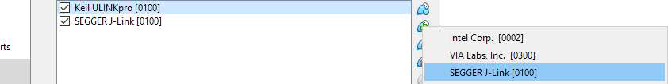
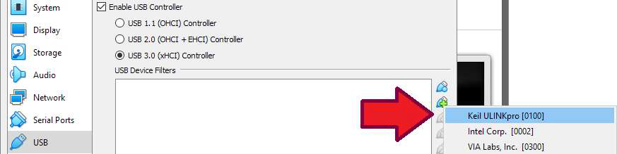
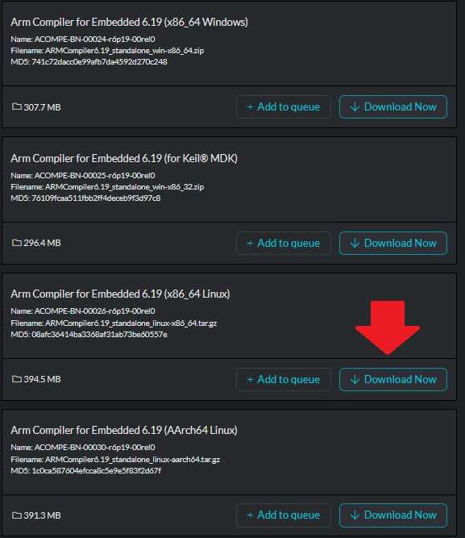
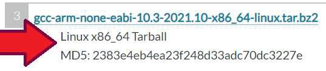

# ML Embedded Evaluation Kit User Guide

## Introduction

This is a brief set of instructions to a select set of AI/ML use-case demos on a single Cortex-M55 core
with Ethos-U55 NPU.

We will show building three applications:

1. Key Word Spotting (KWS) application which runs on the Cortex-M55 High-Efficiency core (H55-HE / M55_1)
2. Image Classification application that runs on the CortexM55 High-Performance core (M55-HP / M55_0)
3. generic “inference runner” application running on the M55-HP core

The KWS application on M55-HE along with the Image Classification application on M55-HP continuously listens to the audio input from the built-in microphones on the Alif base board. When the word `Go` is recognized, a command is sent to the M55-HP core to initiate the image classification application.

The image classification application uses the camera to detect objects and displays the image output of the camera to a display along with the inferred results of the image classification in real time. The M55-HE continues to listen for keywords and upon detecting the word `Stop`, a command is sent to the M55-HP core to stop the image classification inference.

The inference runner application provides a way to easily take a model and have it operate on a data buffer containing data collected from any of the sensors on the AI/ML AppKit such as the camera, microphones, or IMU.

We will show how to run individual applications on the AI/ML AppKit without a debugger probe as well as running the combination of the KWS + Image Classification applications where the KWS application starts and stops the Image Classification application.


## Required Hardware and Setup

- Alif AI/ML AppKit (Gen2) with camera and display
- Micro USB cable

Follow the instructions in the AI/ML AppKit (Gen2) Quick Start Guide to power up your AppKit and determine which virtual COM port is connected to the SEUART that is used for programming the chip.

### Power and Serial Port cable

Connect a USB cable between your PC and the AI/ML AppKit at J2 (PRG USB) micro-USB connector.

This cable serves two purposes, it provides power to the AppKit along with two multiplexed serial ports selectable via jumpers,
1. SEUART console
1. Debug consoles - UART2 (M55-HE) or UART4 (M55-HP) (jumper selected at “J15”)


## Required Software and Setup

- Ubuntu 20.04 or Ubuntu 22.04 or macOS with Apple M Chip
- Oracle VirtualBox (not required with macOS)
- Alif Security Toolkit (SETOOLS) Version v1.0.0

### Virtual Machine Setup

**NOTE:** Set hard-disk size to atleast 100GB = 102400MiB

**NOTE:** add sudo:
```
su –
sudo adduser [username] sudo
```
Reboot.

Follow the guide at this page to create an Ubuntu virtual machine using Virtual Box. You should proceed far enough to install the VirtualBox Guest Additions. This enables USB support and allows for using Arm DS to debug from within Ubuntu later in the guide. In the machine settings, under the USB category, add the ULINKpro or J-Link debugger to your USB Device filters. After adding the USB device to the filter, unplug the device and plug it back in again. The USB devices that are pulled into the Virtual Machine are not available in Windows while the box is checked. To restore the functionality to Windows, uncheck the box, unplug the device, and plug it back in.




### Ubuntu Setup

With Ubuntu running, run the below commands to get the environment ready for development.

```
sudo apt update
sudo apt upgrade -y
sudo apt install libncurses5 libc6-i386 lib32gcc1 lib32stdc++6 lib32z
sudo apt install curl dos2unix python-is-python
snap install cmake –classic
```

At the time of writing, the following software versions were used:

- Python 3.
- Pip 22.1.
- CMake 3.23.
- Option-1: Arm clang compiler toolchain.
- Option-2: Arm GNU GCC compiler toolchain.

#### Install Python3

You need python version 3.10 or higher for use with the latest vela compiler. You can download and install python3 using the following command:
```
sudo apt-get install python3.10 python3.10-venv libpython3.10 libpython3.10-dev
```

Verify Python
```
python3
```

#### Arm Clang Compiler (v6.19 or above) setup – Option 1

1. Start with downloading the .tgz file for Arm Compiler for Embedded (https://developer.arm.com/downloads/view/ACOMPE) and then extract it.<br>

2. Within the extracted folder is a shell script. Open a terminal window, navigate to the extracted folder, and run the shell script.
3. Download the tar.gz file for Arm Clang Compiler and use sudo to extract it to `/usr/local/bin/`
    ```
    sudo tar xf ARMCompiler6.19_standalone_linux-x86_64.tar.gz -C /usr/local/bin
    ```
4. Add the ARM license server to your environment (if applicable), example shown:
    ```
    sudo sh -c "echo export ARMLMD_LICENSE_FILE=PORT@IPADDRESS > /etc/profile.d/arm-license.sh"
    ```
5. After extracting Arm Clang compiler, we will need to add it to the path, as example shown below
    ```
    sudo sh -c "echo export PATH=/usr/local/bin/ArmCompiler6.19/bin:$PATH > /etc/profile.d/arm-compiler.sh"
    ```
6. Log out and then log in for the above environment changes to take effect.

#### Arm GNU GCC Compiler (v12.3 or above) Setup – Option 2

1. Search on Google and download the GNU Arm Embedded Toolchain for the file shown.<br>
    https://developer.arm.com/downloads/-/arm-gnu-toolchain-downloads <br>
2. Select the wanted version and download GCC for x86_64 Linux hosted cross toolchains / AArch32 bare-metal target (arm-none-eabi).
   
3. Extract the downloaded file and use sudo to extract it to /usr/local/bin
    ```
    sudo tar xf arm-gnu-toolchain-12.3.rel1-x86_64-arm-none-eabi.tar.xz -C /usr/local/bin
    ```
4. Add it to the path, as shown
    ```
    sudo sh -c "echo export PATH=/usr/local/bin/arm-gnu-toolchain-12.3.rel1-x86_64-arm-none-eabi/bin:$PATH >
    /etc/profile.d/arm-compiler.sh"
    ```
5. Log out and then log in for the above environment changes to take effect.


### Mac Setup

#### Install brew.
You can get it from https://brew.sh/ and paste the install script found in main page to macOS terminal. Optional brew install with the pkg-file: take the latest version of homebrew pgk-file from https://github.com/Homebrew/brew/releases.

#### Install Python3
From https://www.python.org/downloads/macos/, download `macOS 64-bit universal2 installer` -> `Python 3.10.11 - April 5, 2023` and install it. You can try newer version but this has been verified to work.<br>
You also need to install pip, in terminal:
```
curl https://bootstrap.pypa.io/get-pip.py -o get-pip.py
python3 get-pip.py
```

#### Install the latest CMake
From https://cmake.org/download/ choose the correct .dmg file and install it.

#### Arm Clang Compiler (v6.19 or above) setup – Option 1
macOS is not supported at the moment.

#### Arm GNU GCC Compiler (v12.3 or above) Setup – Option 2
Go to https://developer.arm.com/downloads/-/arm-gnu-toolchain-downloads

Select the wanted version -> `macOS (Apple silicon) hosted cross toolchains` -> `AArch32 bare-metal target (arm-none-eabi)` -> `arm-gnu-toolchain-12.3.rel1-darwin-arm64-arm-none-eabi.pkg`. Install the pkg-file.

#### Additional installs and modifications

1. In terminal:
    ```
    brew install libsndfile
    ```
2. If you don't have .zprofile and .zshrc in your home folder, create them in terminal:
    ```
    touch .zprofile
    touch .zshrc
    ```
3. Add following lines to your ~/.zprofile so that libsndfile is used from correct place:
    ```
    export CPATH=/opt/homebrew/include
    export LIBRARY_PATH=/opt/homebrew/lib
    ```
4. In terminal:
    ```
    pip install pysndfile
    ```
5. Add following line to ~/.zshrc:
    ```
    export DYLD_LIBRARY_PATH="/opt/homebrew/lib:$DYLD_LIBRARY_PATH"
    ```
6. Be sure to have the need version of make. In terminal:
    ```
    brew install make
    ```
7. Use the installed make, add following line to ~/.zshrc:
    ```
    PATH="/opt/homebrew/opt/make/libexec/gnubin:$PATH"
    ```
8. Tensorflow uses wget, make sure you have it installed, in terminal
    ```
    brew install wget
    ```
9. GNU GCC path needs to be added to ~/.zshrc:
    ```
    export PATH=$PATH:/Applications/ArmGNUToolchain/12.3.rel1/arm-none-eabi/bin
    ```

## Building the use-case applications

### Common Setup for all AI/ML use-cases:

1. Access our public repository on Alif Semiconductor GitHub account<br>
    https://github.com/alifsemi/alif_ml-embedded-evaluation-kit
2. Clone the above repository to your PC.
    ```
    git clone https://github.com/alifsemi/alif_ml-embedded-evaluation-kit.git
    ```
3. Initialize and update the required submodules.
    ```
    cd alif_ml-embedded-evaluation-kit
    git submodule update --init
    ```
4. Download and Setup required AI/ML resources.
    ```
    python3.10 set_up_default_resources.py --additional-ethos-u-config-name ethos-u55-256
    ```
    The above python command will take some time, around a few minutes. Python command
    fetches and optimizes the needed Ethos models for all the use cases in the kit.

    Troubleshooting:

    - If you get errors about certificate: e.g.
        ```
        urllib.error.URLError: <urlopen error [SSL: CERTIFICATE_VERIFY_FAILED] certificate verify failed: unable to get local issuer certificate (_ssl.c:1007)>
        ```
        Go to Python installation directory `/Applications/Python <version>/` and run `./Install\ Certificates.command`

    - If you get errors right at the beginning, try doing the following and run the command again:
        ```
        sudo apt-get install python3-pip
        sudo apt install python3-venv
        ```

    In all these error cases, delete the folder “resources_downloaded” and rerun the commands from step 4.


### Building The Key Word Spotting (KWS) Use-Case For The M55-HE Core.

1. Create a build directory for M55-HE core based applications.
    ```
    mkdir build_he
    cd build_he
    ```

**Using ARM Clang Toolchain**

2. Configure the build using CMake.
    ```
    cmake -DTARGET_PLATFORM=ensemble \
    -DTARGET_SUBSYSTEM=RTSS-HE \
    -DTARGET_BOARD=AppKit \
    -DTARGET_REVISION=B \
    -DCMAKE_TOOLCHAIN_FILE=scripts/cmake/toolchains/bare-metal-armclang.cmake \
    -DGLCD_UI=NO \
    -DLINKER_SCRIPT_NAME=ensemble-RTSS-HE-TCM \
    -DCMAKE_BUILD_TYPE=Release \
    -DLOG_LEVEL=LOG_LEVEL_DEBUG ..
    ```

3. Build the Project using Make
    ```
    make ethos-u-alif_kws -j
    ```
4. The output should be in `/build_he/bin/ethos-u-alif_kws.axf`

*NOTE: The debug console for this use-case will be UART2, and the jumper on the AI/ML AppKit needs to be set accordingly as noted in the Gen 2 AI/ML AppKit Quick Start Guide.*

UART select jumpers set for UART2:


**Using GNU GCC Toolchain**

5. Replace `bare-metal-armclang.cmake` to `bare-metal-gcc.cmake` in step 2 above.

### Building The Image Classification (IC) Use-Case For The M55-HP Core.

1. Create a build directory for M55-HP core-based applications.
    ```
    mkdir build_hp
    cd build_hp
    ```
**Using ARM Clang Toolchain**

2. Configure the build using CMake
    ```
    cmake -DTARGET_PLATFORM=ensemble \
    -DTARGET_SUBSYSTEM=RTSS-HP \
    -DTARGET_BOARD=AppKit \
    -DTARGET_REVISION=B \
    -DCMAKE_TOOLCHAIN_FILE=scripts/cmake/toolchains/bare-metal-armclang.cmake \
    -DCONSOLE_UART=4 \
    -DCMAKE_BUILD_TYPE=Release \
    -DLOG_LEVEL=LOG_LEVEL_DEBUG ..
    ```

These cmake options permit the default use of LCD and SRAM, which is okay since the HE image has them disabled. The `CONSOLE_UART=4` option avoids the HE image’s use of UART and could be omitted to run standalone HP applications.

3. Build the Project using Make.
    ```
    make ethos-u-alif_img_class -j
    ```
4. The output should be produced in `build_hp/bin/ethos-u-alif_img_class.axf`

**Using GNU GCC Toolchain**

5. Replace `bare-metal-armclang.cmake` to `bare-metal-gcc.cmake` in step 2 above.

### Building the Generic Inference Runner use-case for M55-HP core.

1. Create a build directory for M55-HP core,
    ```
    mkdir build_hp_infrun
    cd build_hp_infrun
    ```

**Using ARM Clang toolchain**

2. Add TFLite custom model:

    a. If you already have a vela optimized custom model file (.tflite), then copy it into below directory,
    ```
    cp custom_model_vela_H256.tflite <path-to-repo>/resources_downloaded/inference_runner
    ```

    b. Otherwise, download your non-Vela TFLite model (from https://github.com/ARM-software/ML-zoo/), ex: `har_int8.tflite`. Copy it into below directory,
    ```
    cp har_int8.tflite <ml_demo_root>/models
    ```
    **NOTE:** avoid the `resources_downloaded` directory, as we don’t want to accidentally wipe it out.

    c. Run vela compiler on it, for the HP:
    ```
    resources_downloaded/env/bin/activate
    cd <ml_demo_root>/models
    vela --accelerator-config=ethos-u55-256 \
      --optimise Performance \
      --config ../scripts/vela/default_vela.ini \
      --memory-mode=Shared_Sram \
      --system-config=Ethos_U55_High_End_Embedded \
      --output-dir=. har_int8.tflite
    ```
    **NOTE:** for the M55-HE core, change `u55-256` to `u55-128`.<br>
    **NOTE:** you could also use a different INI file to try to tune for your system.

    d. This will produce a vela optimized tflite file under
    ```
    <ml_demo_root>/models/har_int8_vela.tflite
    ```

    e. Rename this with a suffix H128 or H256 to indicate which Ethos-U55 core you built it for.
    ```
    mv har_int8_vela.tflite har_int8_vela_H256.tflite
    ```

3. Whether you prepared the model yourself, or are pointing at another pre-optimized model, add the CMake option
   ```
   -Dinference_runner_MODEL_TFLITE_PATH=<path-to-model>/custom_vela_H256.tflite`
   ```

4. Configure the build using `CMake`
    ```
    cmake .. \
      -Dinference_runner_MODEL_TFLITE_PATH=<path_to_model>/models/har_int8_vela_H256.tflite
      -DUSE_CASE_BUILD=inference_runner \
      -DTARGET_PLATFORM=ensemble \
      -DTARGET_SUBSYSTEM=RTSS-HP \
      -DTARGET_BOARD=AppKit \
      -DTARGET_REVISION=B \
      -DLINKER_SCRIPT_NAME=ensemble-RTSS-HP-infrun \
      -DCMAKE_TOOLCHAIN_FILE=scripts/cmake/toolchains/bare-metal-armclang.cmake \
      -DCMAKE_BUILD_TYPE=Release \
      -DLOG_LEVEL=LOG_LEVEL_Debug
    ```

5. Build the project using `Make`
    ```
    make -j
    ```

6. Open Tera-Term or any other serial port console app. Connect to UART4 (for M55-HP) or UART2 (for M55-HE). Configure serial port settings to 115200, 8N1.

7. Reset the board and review the output on the serial console.

**Using GNU GCC toolchain**

1. Follow the same steps as above, except in step 4. Change the following in CMake command,
    ```
    -DCMAKE_TOOLCHAIN_FILE=scripts/cmake/toolchains/bare-metal-gcc.cmake \
    -DLINKER_SCRIPT_NAME=ensemble-RTSS-HP-infrun \
    ```

The output should be produced in `build_hp_infrun/bin/ethos-u-inference_runner.axf`

## Running the Applications Standalone without Debuggers

Refer to the Alif Security Toolkit Quick Start Guide on how to download and install SETOOLS on your platform.
```
The recommended <release-location> installation directories are:
Windows: C:\app-release-exec
Linux: /home/$USER/app-release-exec-linux
Mac: /Users/$USER/app-release-exec-macos
```

After building the applications above, these steps will prepare them to be stored in the Alif device and
booted by the Secure Enclave automatically.<br>
The SETOOLS make use of `.bin` files instead of `.axf` or `.elf` files.

### Option-1

You can find the `mram.bin` file in the `build` folder under `.../bin/sectors/<use-case>/` folder.<br>
Rename the `mram.bin` to appropriate use-case filename, found from the generated `.axf` filename.<br>
Example:
```
mv mram.bin ethos-u-alif_kws.bin
cp ethos-u-alif_kws.bin /home/$USER/app-release-exec-linux/build/images
```

### Option-2

You will first need to convert the `.axf` file into a `.bin` file. Depending on the compiler option used to generate the binary `.axf or .elf` file, you will need to use different commands.<br>
If you followed Option-1 to install Arm DS and Arm Clang Compiler for Embedded, then use the `fromelf` command. Or if you followed Option-2 to install the Arm GNU Compiler for Embedded, then use the `arm-none-eabi-objcopy` command.

1. For **KWS** use-case:
    ```
    cd build_he/bin
    ```
    ```
    fromelf --bin –output=ethos-u-alif_kws.bin ethos-u-alif_kws.axf
    ```
    or
    ```
    arm-none-eabi-objcopy -O binary ethos-u-alif_kws.axf ethos-u-alif_kws.bin
    ```

2. For **Image Classification** use-case:
    ```
    cd build_hp/bin
    ```
    ```
    fromelf --bin –output=ethos-u-alif_img_class.bin ethos-u-alif_img_class.axf
    ```
    or
    ```
    arm-none-eabi-objcopy -O binary ethos-u-alif_img_class.axf ethos-u-alif_img_class.bin
    ```

Copy the converted binaries (`.bin` file) to the following directory: `/home/$USER/app-release-exec-linux/build/images`


#### The next step is to generate the binary ATOC image for the applications.

1. Create a new JSON file called ```\build\config\kws_demo.json``` with the following content.
    ```
    {
        "HE_Voice": {
            "binary": "ethos-u-alif_kws.bin",
            "version": "1.0.0",
            "mramAddress": "0x80480000",
            "cpu_id": "M55_HE",
            "flags": ["boot"],
            "signed": false
        }
    }
    ```
2. Create a second new JSON file called `/home/$USER/app-release-exec-linux\build\config\img_class_demo.json` with the following content.
    ```
    {
        "HP_Image": {
            "binary": "ethos-u-alif_img_class.bin",
            "version" : "1.0.0",
            "mramAddress": "0x80008000",
            "cpu_id": "M55_HP",
            "flags": ["boot"],
            "signed": false
        }
    }
    ```
3. Next, run `app-gen-toc`, from SETOOLS package in `/home/$USER/app-release-exec-linux`, to generate the package image, which will be written to the file `AppTocPackage.bin` in the build directory. We will use the `-f` option to specify the input filename (`kws_demo.json`) for the configuration file we just created. Execute this command:<br>
    Windows:
    ```
    app-gen-toc.exe -f build\config\kws_demo.json
    ```
    Linux/Mac:
    ```
    ./app-gen-toc -f build/config/kws_demo.json
    ```
4. Finally, write the applications using the SETOOLS command<br>
    Windows:
    ```
    app-write-mram.exe -p
    ```
    Linux/Mac:
    ```
    sudo ./app-write-mram -p
    ```

**NOTE:** binaries written to MRAM must be 16-byte aligned or the write operation will fail. If you see a warning in the SE Tools about the binaries not being 16-byte aligned, the `-p` option will pad the binaries to be 16-byte aligned.

5. Repeat steps 3 & 4 for `img_class_demo.json`, to program the image-classification use-case demo to M55-HP.

**NOTE:** Applications output debug messages to UART2 (M55-HE) and UART4 (M55-HP).


### Running Keyword Spotting + Image Classification on dual-core (HE+HP) SoC

Once we have built and verified the Keyword Spotting (KWS) and Image Classification (IC) use-cases
individually on single-cores, we are now ready to program a dual-core demo, using the above generated
binaries.

1. Create a new JSON file called `/home/$USER/app-release-exec-linux/build/config/kws_IC_demo.json` with the following content.
    ```
    {
        "IC": {
            "binary": "ethos-u-alif_img_class.bin",
            "version": "1.0.0",
            "mramAddress": "0x80008000",
            "cpu_id": "M55_HP",
            "flags": ["boot"],
            "signed": false
        },

        "KWS": {
            "binary": "ethos-u-alif_kws.bin",
            "version": "1.0.0",
            "mramAddress": "0x80480000",
            "cpu_id": "M55_HE",
            "flags": ["boot"],
            "signed": false
        }
    }
    ```
2. Next, follow the steps from step #3 above to program the binaries to the AI/ML AppKit.


### KWS Usage Notes

You should be able to run the application and see the below in the very first lines of output from UART2
```
INFO - Processor internal clock: 160000000Hz
INFO - platform_init: complete
DEBUG - EthosU IRQ#: 55, Handler: 0x0x100f4cd
INFO - Ethos-U device initialised
INFO - Ethos-U version info:
INFO -  Arch:       v1.1.0
INFO -  Driver:     v0.16.0
INFO -  MACs/cc:    128
INFO -  Cmd stream: v0
INFO - Target system design: Ensemble
INFO - ARM ML Embedded Evaluation Kit
INFO - Version 23.11.0 Build date: Apr 25 2024 @ 13:00:32
INFO - Copyright 2021-2023 Arm Limited and/or its affiliates <open-source-office@arm.com>
```

The application will run in a loop listening to the microphones. It will report if the keywords from the
following list are spotted: `up`, `down`, `left`, `right`, `yes`, `no`, `go`, `stop`, `on`, `off`.

Correct behavior:
```
Original sample stats: absmax = 31, mean = 0
Normalized sample stats: absmax = 664, mean = 1 (gain = 27 dB)
```

Detection of `up` and `down` key words:
```
Original sample stats: absmax = 31, mean = 0
Normalized sample stats: absmax = 664, mean = 1 (gain = 27 dB)
DEBUG - Input tensor populated
Preprocessing time = 9.430 ms
Inference time = 2.727 ms
Postprocessing time = 0.030 ms
INFO - Final results:
INFO - Total number of inferences: 7
INFO - For timestamp: 0.000000 (inference #: 0); label: _unknown_, score: 0.719061; threshold: 0.500000
INFO - For timestamp: 0.500000 (inference #: 1); label: _unknown_, score: 0.634090; threshold: 0.500000
INFO - For timestamp: 1.000000 (inference #: 2); label: _unknown_, score: 0.722007; threshold: 0.500000
INFO - For timestamp: 1.500000 (inference #: 3); label: up, score: 0.825285; threshold: 0.500000
INFO - For timestamp: 2.000000 (inference #: 4); label: up, score: 0.994992; threshold: 0.500000
INFO - For timestamp: 2.500000 (inference #: 5); label: down, score: 0.985454; threshold: 0.500000
INFO - For timestamp: 3.000000 (inference #: 6); label: down, score: 0.973029; threshold: 0.500000
```

Incorrect behavior (mics not working):
```
Original sample stats: absmax = 0, mean = 0
Normalized sample stats: absmax = 0, mean = 0 (gain = 80 dB)
```


## Further information

Beyond the demo build described above, many other use cases and options of the upstream Arm ML Embedded Evaluation kit should work on Alif hardware.<br>
One easy alternative build is to replace the image-classification use-case on the M55-HP core with
object-detection (face-detection).


### Tested use cases

Of the original ARM use cases the following are known to work:
- kws
- img_class
- object_detection
- vww
- inference_runner
- noise_rejection

New use cases have been added:
- alif_kws (equivalent of kws with live microphone input)
- alif_img_class (equivalent of img_class with live camera input)
- alif_object_detection (equivalent of object_detection with live camera input)
- alif_vww (equivalent of vww with live camera input)
- asr (automatic speech recognition)


### Pre-built Application Binaries

You can find the pre-built application binaries for our “alif” use-cases at the link below<br>
[AI/ML AppKit Pre-Built Demos](https://alifsemi.com/download/AAPK0002)

The following applications are part of the package,

- Alif Image Classification+Keyword Spotting use-case.
- Alif Object Detection use-case.
- NOTES:
    - For Object Detection demo, you need to press the joystick button SW2 on the buttom of the board for continuous detection.
    - For Image-Classification + Keyword Spotting demo, you need to speak in front of the AppKit the words `stop` to stop the classification and `go` to run the classifications.


### Deploying pre-built application binaries to the AppKit (Windows OS)

We have created batch scripts for Windows OS to make it easy to download the pre-built binaries to the AppKit:

- Connect the AppKit to the Windows PC with the micro-USB cable at port `PRG USB`.
- On the Windows PC, download the pre-build application binaries (AppKit_Demos.zip) to an appropriate folder and extract the contents of the zip file.Read the "AppKit demos.pdf" file contained in the extracted folder for instructions on the dependencies for the batch scripts.
- Make sure you run `maintenance.exe -d` command from SETOOLS folder to select the 1st serial COM port.
- Once the above steps are done, simply double-click the appropriate use-case batch file to download the binary to the AppKit. The use-case demo will start running once the download is complete. Sometimes it takes a few seconds longer for the demo to start.
- Open a serial port console application (ex: TeraTerm) and connect to the 2nd serial COM port that is detected by PC. Configure the serial port to 115200, 8N1 setting to see the debug log messages. Most applications use COM2 for debug output except the image classification application which uses COM4.


Putting jumpers on the two pairs of pins as shown on J15 selects UART2, while putting jumpers on
the two pairs of pins as shown on J15 selects UART4.


### Alif-specific build options

There are several build options – these determine the behavior of the porting layer. Once these are set, you can build multiple use cases in one build directory using these options. See original ARM documentation for details of the upstream options. Alif has added extra options:

`-DTARGET_REVISION=<A|B>`<br>
Specifies which revision (generation) of Ensemble device is being targeted – A is generation 1, B is generation 2. (Default is B)

`-DTARGET_BOARD=<DevKit|AppKit|DevKit_Baseboard|AppKit_Alpha1|AppKit_Alpha2>`<br>
Specifies the target board. (Default is AppKit)<br>
-DTARGET_REVISION=A supports the following boards: DevKit, AppKit_Alpha1 and AppKit_Alpha2<br>
-DTARGET_REVISION=B supports the following boards: DevKit, AppKit and DevKit_Baseboard

`-DROTATE_DISPLAY=<0|90|180|270>`<br>
Rotates the display by the specified amount and reorganizes the UI if necessary. 90 and 270 will be appreciably slower. (Default is 0)

`-DGLCD_UI=<ON|OFF>`<br>
Enables or disables the basic “GLCD” UI emulating ARM’s MPS3 display. This is the display method of all the original ARM use cases and alif live audio demos.. (Default is ON) If running on two cores, one of the applications must have this disabled.<br>
The Alif camera use cases switch over from the GLCD display to a full LVGL UI, and the LVGL UI functions independently of this option – it can be turned off to save RAM.

`-DCONSOLE_UART=<2|4>`<br>
Specifies which UART to use for console. (Default is 2)

`-DLINKER_SCRIPT_NAME`<br>
Specifies a linker script/scatter file to use. The default is `ensemble-RTSS-<HE|HP>`, a layout which uses
both TCM and SRAM0/SRAM1.<br>
If running on two cores, the M55-HE core must use the alternative ensemble-RTSS-HE-TCM layout which uses only TCM. This will only fit the smallest use-cases such as kws or alif_kws, and GLCD_UI must be disabled.<br>
To fit in TCM the kws use case must have its activation area reduced using `-Dkws_ACTIVATION_BUF_SZ=0x20000`. (This is already the default for alif_kws).
