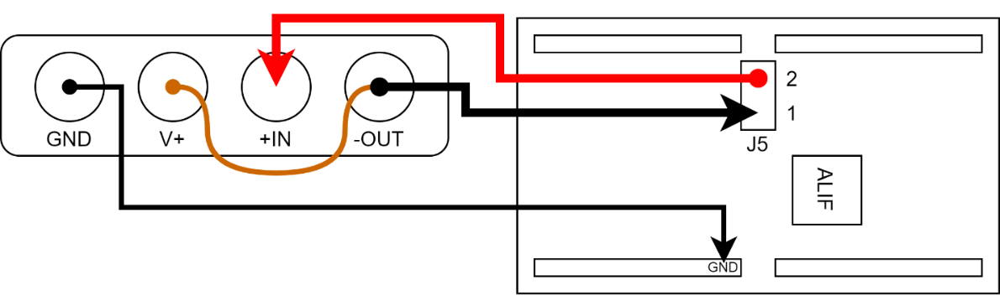
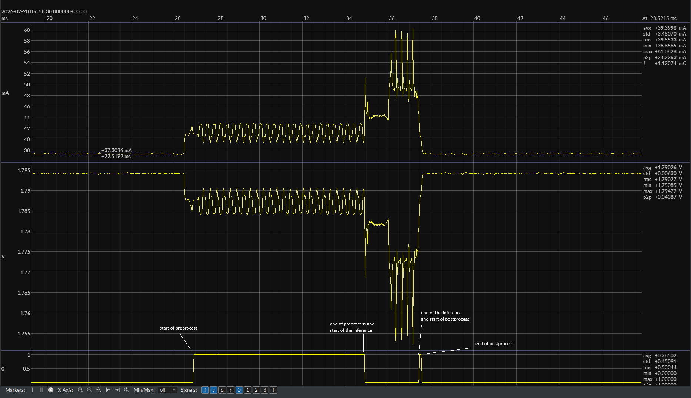

# Alif Semiconductor ML Embedded Evaluation Kit Benchmark User Guide

This document provides instructions on how to run benchmarks for the ML models included in the Alif Semiconductor ML Embedded Evaluation Kit Examples repository. The benchmarks will help you evaluate the performance of the ML models on the Alif DevKit boards.

## Required Hardware and Setup

- Alif AI/ML DevKit (depending on the use case, with camera and display)
- Micro USB/ USB C cable for power and data connection
- JouleScope for power measurement
- Host computer with the necessary software and drivers installed

Before running the benchmarks, ensure that you have set up the build environment and created loadable images as per the instructions in the [ML Embedded Evaluation Kit document](ML_Embedded_Evaluation_Kit.md). Use the CMAKE option `-DCMAKE_BUILD_TYPE=Release` when building the examples to ensure that the benchmarks are run in Release mode, which provides optimized performance metrics. Use the `-DGPIO_PROFILING=ON` option to enable profiling during the benchmark runs. Use the `-DGLCD_UI=OFF` option to disable the GLCD UI during the benchmark runs, which can affect the performance metrics.

JouleScope is used for power measurement, and the results are recorded in milliwatts (mW) along with the corresponding voltage (V) and current (mA) values. See more about Alif power measurement and power modes in the [Ensemble® MCU and Fusion Processors Power Modes](https://alifsemi.com/download/AAPN0028) document.

## JouleScope Setup

1. Connect the JouleScope to your host computer and ensure it is recognized.
2. Connect the JouleScope in series with the power supply to the Alif DevKit board.
3. Configure the JouleScope to measure voltage, current, power and signal 0. Set the appropriate range for voltage and current based on the expected values for the benchmarks.


### Joulescope setup for power measurement during benchmarks.

For power measurement, with the JouleScope connected in series to measure the current and voltage supplied to the board.

DevKit-e7:
* Connect to JP5 like in image below

DevKit-e8:
* Use JP2

DevKit-e1c:
* Use JP3




### Joulescope setup for GPIO profiling during benchmarks.
When GPIO profiling is enabled, certain GPIO pin is configured to toggle at specific stages of the benchmark (preprocessing, inference, postprocessing) to correlate power measurements with these stages.
This toggling can be observed from Joulescope's digital input channels, which can be used to correlate power measurements with specific stages of the benchmark.
Toggled pin is the same pin as blue LED pin for each board.

From back of the Joulescope, connect the GPIO IN0 pin to the corresponding pin on the Alif DevKit as follows:

DevKit-e7:
    - IN0 to pin P12_0

DevKit-e8:
    - IN0 to pin P12_0

DevKit-e1c:
    - IN0 to pin P4_3

For all devkits, connect the GND pin of the JouleScope to a GND pin on the devkit and vref pin of the JouleScope to a 1.8V pin on the devkit.

## Running the Benchmarks

### GPIO Profiling
GPIO Profiling is supported for the following use cases:
- alif_kws
- alif_ad
- alif_asr
- alif_image
- alif_object_detection
- alif_vww

All other use cases do use tensorflow and U55 except for alif_asr which uses Executorch and U85.

When GPIO profiling is enabled, the GPIO pin will toggle at the following stages of the benchmark:
- Preprocessing: GPIO pin goes HIGH at the start of preprocessing
- Inference: GPIO pin goes LOW at the start of inference and goes HIGH at the end of inference.
- Postprocessing: GPIO pin goes LOW at the end of postprocessing.

All unnecessary prints and UI updates are removed during the benchmark runs to ensure accurate measurement of the performance metrics.





### NPU Cycles
When GPIO profiling is disabled, the NPU cycles are measured using the ARM Performance Monitoring Unit (PMU) and recorded in the benchmark results.
Profiling must be disabled because NPU cycles are measured using the ARM Performance Monitoring Unit (PMU) and could affect the power measurements and GPIO profiling.
The PMU provides detailed information about the performance of the NPU during inference, including the number of cycles taken for each stage of the benchmark.

NPU cycles are printed to selected UART. Example of the output for alif_kws is as follows:
```
INFO - Profile for Inference:
INFO - NPU ACTIVE: 404973 cycles
INFO - NPU AXI0_RD_DATA_BEAT_RECEIVED: 125388 beats
INFO - NPU AXI0_WR_DATA_BEAT_WRITTEN: 48254 beats
INFO - NPU AXI1_RD_DATA_BEAT_RECEIVED: 17493 beats
INFO - NPU IDLE: 635 cycles
INFO - NPU TOTAL: 405608 cycles

```
