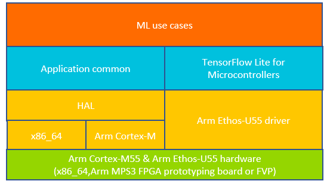

# Arm® ML embedded evaluation kit

## Overview

The ML embedded evaluation kit provides a range of ready to use machine learning (ML) applications for users to develop ML workloads running on the Arm® Ethos-U NPU and
Arm® Cortex-M CPUs. You can also access metrics such as inference cycle count to estimate performance.

>*The Arm® Ethos-U NPU is a new class of ML processor, specifically designed
to accelerate ML computation in constrained embedded and IoT devices.*

## ML use cases

Experiment with the included end-to-end software use cases and create your own ML applications for Cortex-M CPU and Ethos-U NPU.

|   ML application                     |  Description | Neural Network Model |
| :----------------------------------: | :-----------------------------------------------------: | :----: |
|  [Image classification](./docs/use_cases/img_class.md)        | Recognize the presence of objects in a given image | [Mobilenet V2](https://github.com/ARM-software/ML-zoo/tree/e0aa361b03c738047b9147d1a50e3f2dcb13dbcb/models/image_classification/mobilenet_v2_1.0_224/tflite_int8)   |
|  [Keyword spotting(KWS)](./docs/use_cases/kws.md)             | Recognize the presence of a key word in a recording | [MicroNet](https://github.com/ARM-software/ML-zoo/tree/9f506fe52b39df545f0e6c5ff9223f671bc5ae00/models/keyword_spotting/micronet_medium/tflite_int8) |
|  [Automated Speech Recognition(ASR)](./docs/use_cases/asr.md) | Transcribe words in a recording | [Wav2Letter](https://github.com/ARM-software/ML-zoo/tree/1a92aa08c0de49a7304e0a7f3f59df6f4fd33ac8/models/speech_recognition/wav2letter/tflite_int8) |
|  [KWS and ASR](./docs/use_cases/kws_asr.md) | Utilise Cortex-M and Ethos-U to transcribe words in a recording after a keyword was spotted | [MicroNet](https://github.com/ARM-software/ML-zoo/tree/9f506fe52b39df545f0e6c5ff9223f671bc5ae00/models/keyword_spotting/micronet_medium/tflite_int8)  [Wav2Letter](https://github.com/ARM-software/ML-zoo/tree/1a92aa08c0de49a7304e0a7f3f59df6f4fd33ac8/models/speech_recognition/wav2letter/tflite_int8) |
|  [Anomaly Detection](./docs/use_cases/ad.md)                 | Detecting abnormal behavior based on a sound recording of a machine | [MicroNet](https://github.com/ARM-software/ML-zoo/tree/7c32b097f7d94aae2cd0b98a8ed5a3ba81e66b18/models/anomaly_detection/micronet_medium/tflite_int8/)|
|  [Visual Wake Word](./docs/use_cases/visual_wake_word.md)                 | Recognize if person is present in a given image | [MicroNet](https://github.com/ARM-software/ML-zoo/tree/7dd3b16bb84007daf88be8648983c07f3eb21140/models/visual_wake_words/micronet_vww4/tflite_int8/vww4_128_128_INT8.tflite)|
|  [Noise Reduction](./docs/use_cases/noise_reduction.md)        | Remove noise from audio while keeping speech intact | [RNNoise](https://github.com/ARM-software/ML-zoo/raw/a061600058097a2785d6f1f7785e5a2d2a142955/models/noise_suppression/RNNoise/tflite_int8)   |
|  [Object detection](./docs/use_cases/object_detection.md)      | Detects and draws face bounding box in a given image | [Yolo Fastest](https://github.com/emza-vs/ModelZoo/blob/master/object_detection/yolo-fastest_192_face_v4.tflite)
|  [Generic inference runner](./docs/use_cases/inference_runner.md) | Code block allowing you to develop your own use case for Ethos-U NPU | Your custom model |

## Recommended build targets 

This repository is for building and deploying Machine Learning (ML) applications targeted for Arm® Cortex®-M and Arm®
Ethos™-U NPU.
To run evaluations using this software, we suggest using:

- [MPS3 board](https://developer.arm.com/tools-and-software/development-boards/fpga-prototyping-boards/mps3) with
  [Arm® Corstone-300](https://developer.arm.com/Processors/Corstone-300) or [Arm® Corstone-310](https://developer.arm.com/Processors/Corstone-310) implementations.
  - Arm® Corstone™-300 runs a combination of
  the [Arm® Cortex™-M55 processor](https://www.arm.com/products/silicon-ip-cpu/cortex-m/cortex-m55) and the
  [Arm® Ethos™-U55 NPU](https://www.arm.com/products/silicon-ip-cpu/ethos/ethos-u55).
  - Arm® Corstone™-310 runs a combination of
      the [Arm® Cortex™-M85 processor](https://www.arm.com/products/silicon-ip-cpu/cortex-m/cortex-m85) and the
      [Arm® Ethos™-U55 NPU](https://www.arm.com/products/silicon-ip-cpu/ethos/ethos-u55).

- [Arm® Corstone™-300 MPS3 based Fixed Virtual Platform (FVP)](https://developer.arm.com/tools-and-software/open-source-software/arm-platforms-software/arm-ecosystem-fvps)
  offers a choice of the [Arm® Ethos™-U55 NPU](https://www.arm.com/products/silicon-ip-cpu/ethos/ethos-u55)
  or [Arm® Ethos™-U65 NPU](https://www.arm.com/products/silicon-ip-cpu/ethos/ethos-u65) software fast model in combination with
  the new [Arm® Cortex™-M55 processor](https://www.arm.com/products/silicon-ip-cpu/cortex-m/cortex-m55)
  - You can also take advantage of
    [Arm Virtual Hardware](https://www.arm.com/products/development-tools/simulation/virtual-hardware) (AVH) and [run the Fixed Virtual Platform
    in the cloud](./docs/sections/arm_virtual_hardware.md).

>Arm® Corstone™-300 and Corstone™-310 design implementations are publicly available on [Download FPGA Images](https://developer.arm.com/tools-and-software/development-boards/fpga-prototyping-boards/download-fpga-images) page,
or as a [Fixed Virtual Platform of the MPS3 development board](https://developer.arm.com/tools-and-software/open-source-software/arm-platforms-software/arm-ecosystem-fvps).

### Quick Start

To run ML applications on the Cortex-M and Ethos-U NPU:

1. First, verify that you have installed all of [the required prerequisites](sections/building.md#build-prerequisites).
   > **NOTE**: `Dockerfile` is also available if you would like to build a Docker image.

2. Clone the *Ethos-U* evaluation kit repository:

    ```commandline
    git clone "https://review.mlplatform.org/ml/ethos-u/ml-embedded-evaluation-kit"
    cd ml-embedded-evaluation-kit
    ```

3. Pull all the external dependencies with the following command:

    ```commandline
    git submodule update --init
    ```

4. Next, run the `build_default` Python script. It handles the downloading of the neural network models, compiling using 
[Vela](https://review.mlplatform.org/plugins/gitiles/ml/ethos-u/ethos-u-vela), and building the project using CMake.

###### Arm compiler
````commandline
python3.9 ./build_default.py --toolchain arm
````

###### GNU Arm Embedded toolchain
```commandline
python3.9 ./build_default.py
```

5. Change directory to the generated cmake build folder which contains the `.axf` file output in the `bin`
   subdirectory. Launch the application by passing the `.axf` to the FVP you downloaded when installing the prerequisites.
   Alternatively, from the root directory add `<cmake-build-your_config>` to the path to the axf and use one of the
   following commands:

    ```commandline
   From auto-generated (or custom) build directory:
   <path_to_FVP>/FVP_Corstone_SSE-300_Ethos-U55 -a ./bin/ethos-u-kws.axf
   
   From root directory:
   <path_to_FVP>/FVP_Corstone_SSE-300_Ethos-U55 -a <cmake-build-your_config>/bin/ethos-u-kws.axf
    ```

6. A telnet window is launched through which you can interact with the application and obtain performance figures.


**For more details, you can view the [quick start guide](docs/quick_start.md).**

> **Note:** The default flow assumes Arm® *Ethos™-U55* NPU usage, configured to use 128 Multiply-Accumulate units
> and is sharing SRAM with the Arm® *Cortex®-M55*.
>
> Ml embedded evaluation kit supports:
>
> |  *Ethos™-U* NPU  | Default MACs/cc | Other MACs/cc supported | Default Memory Mode | Other Memory Modes supported |
> |------------------|-----------------|-------------------------|---------------------|------------------------------|
> |   *Ethos™-U55*   |       128       |      32, 64, 256        |     Shared_Sram     |          Sram_Only           |
> |   *Ethos™-U65*   |       256       |          512            |    Dedicated_Sram   |         Shared_Sram          |
>
> For more information see [Building](./docs/documentation.md#building).

**See full documentation:**

- [Arm® ML embedded evaluation kit](./docs/documentation.md#arm_ml-embedded-evaluation-kit)
  - [Table of Content](./docs/documentation.md#table-of-content)
  - [Trademarks](./docs/documentation.md#trademarks)
  - **[Prerequisites](./docs/documentation.md#prerequisites)**
    - [Additional reading](./docs/documentation.md#additional-reading)
  - [Repository structure](./docs/documentation.md#repository-structure)
  - [Models and resources](./docs/documentation.md#models-and-resources)
  - **[Building](./docs/documentation.md#building)**
  - [Deployment](./docs/documentation.md#deployment)
  - [Running code samples applications](./docs/documentation.md#running-code-samples-applications)
  - [Implementing custom ML application](./docs/documentation.md#implementing-custom-ml-application)
  - [Testing and benchmarking](./docs/documentation.md#testing-and-benchmarking)
  - **[Troubleshooting](./docs/documentation.md#troubleshooting)**
  - [Appendix](./docs/documentation.md#appendix)
  - [Contributions](./docs/documentation.md#contributing)
  - **[FAQ](./docs/documentation.md#faq)**

## Software and hardware overview

* The ML use cases have common code such as initializing the Hardware Abstraction Layer (HAL)

* The common application code can be run on native host machine (x86_64 or aarch64) or Arm
   Cortex-M architecture because of the HAL

* Google® TensorFlow™ Lite for Microcontrollers inference engine is used to schedule
  the execution of neural network models

*  The [Ethos-U NPU driver](https://review.mlplatform.org/plugins/gitiles/ml/ethos-u/ethos-u-core-driver) is integrated TensorFlow Lite for Microcontrollers
   *  ML operators are delegated to the NPU with CPU fall-back for unsupported operators
   * [CMSIS-NN](https://github.com/ARM-software/CMSIS_5) is used to optimise CPU workload execution with int8 data type
   * Final ML operator fall-back is TensorFlow™ Lite for Microcontrollers' reference kernels

* The provided set of common ML use-case functions will assist in implementing your application logic
   * When modifying use-case code, there is no requirement to modify other components of the eval kit
* The CMake build system will discover and automatically include new ML application code into the compilation workflow

A high level overview of the different components in the software, and the platforms supported out-of-the-box, is shown
in the diagram below.


>Note: The Ethos-U NPU software stack is described [here](https://developer.arm.com/documentation/101888/0500/NPU-software-overview/NPU-software-components?lang=en).

For a more detailed description of the build graph with all major components, see [Building](./docs/documentation.md#building).

### Reusable software

There are source files in the repository that form the core of the Machine Leaning flow for all the use cases. These
are exposed as APIs that the examples can use and even be combined to form chained use cases. The API sources are
designed to be portable across platforms and provide functionality for preprocessing of data, running an inference, and
postprocessing of results. These allow a common flow for all use cases with minor differences in how each of these
blocks are instantiated.

As an independent CMake project, these APIs can be used by or integrated into other projects easily. We also produce
[CMSIS Packs](https://developer.arm.com/tools-and-software/embedded/cmsis/cmsis-packs) with these sources, so they
could be used in all tools/IDEs (for example,
[Arm® Development Studio](https://developer.arm.com/Tools%20and%20Software/Arm%20Development%20Studio) and
[Keil® µVision®](https://www2.keil.com/mdk5/uvision/)) that support the use of CMSIS Packs.


## Contributions
The ML embedded eval kit welcomes contributions. For more details on contributing to the eval kit please see the
the [contributors guide](./docs/sections/contributing.md#contributions).

## Communication

Please, if you want to start public discussion, raise any issues or questions related to this repository, use
[https://discuss.mlplatform.org/c/ml-embedded-evaluation-kit](https://discuss.mlplatform.org/c/ml-embedded-evaluation-kit/)
forum.

## Inclusive language commitment

This product conforms to Arm's inclusive language policy and, to the best of our knowledge,
does not contain any non-inclusive language. If you find something that concerns you, email terms@arm.com.

## Licenses

The ML Embedded applications samples are provided under the Apache 2.0 license, see [License Apache 2.0](../LICENSE_APACHE_2.0.txt).

Application input data sample files are provided under their original license:

|  | Licence | Provenience |
|---------------|---------|---------|
| [Automatic Speech Recognition Samples](./resources/asr/samples/files.md) | [Creative Commons Attribution 4.0 International Public License](./resources/LICENSE_CC_4.0.txt) | <http://www.openslr.org/12/> |
| [Image Classification Samples](./resources/img_class/samples/files.md) | [Creative Commons Attribution 1.0](./resources/LICENSE_CC_1.0.txt) | <https://www.pexels.com> |
| [Keyword Spotting Samples](./resources/kws/samples/files.md) | [Creative Commons Attribution 4.0 International Public License](./resources/LICENSE_CC_4.0.txt) | <http://download.tensorflow.org/data/speech_commands_v0.02.tar.gz> |
| [Keyword Spotting and Automatic Speech Recognition Samples](./resources/kws_asr/samples/files.md) | [Creative Commons Attribution 4.0 International Public License](./resources/LICENSE_CC_4.0.txt) | <http://download.tensorflow.org/data/speech_commands_v0.02.tar.gz> |
| [Visual Wake Word Samples](./resources/vww/samples/files.md) | [Creative Commons Attribution 1.0](./resources/LICENSE_CC_1.0.txt) | <https://www.pexels.com> |
| [Noise Reduction Samples](./resources/noise_reduction/samples/files.md) | [Creative Commons Attribution 4.0 International Public License](./resources/LICENSE_CC_4.0.txt) | <https://datashare.ed.ac.uk/handle/10283/2791/> |
| [Object Detection Samples](./resources/object_detection/samples/files.md) | [Creative Commons Attribution 1.0](./resources/LICENSE_CC_1.0.txt) | <https://www.pexels.com> |
