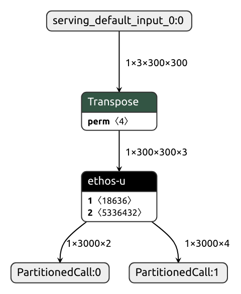

# ML model deployment to Alif device
This guide briefly describes how to deploy your own ML model using the tools and framework in [Alif Semiconductor Ensemble ML Embedded Evaluation Kit](https://github.com/alifsemi/alif_ml-embedded-evaluation-kit).
In this example we use Alif Ensemble DevKit with E7 device, but you may as well find this useful for other Alif devices with Ethos-U NPU.

## ML model format
Alif Semiconductor Ensemble ML Embedded Evaluation Kit repository uses the [TensorFlow Lite for Microcontrollers](https://github.com/tensorflow/tflite-micro) to run ML models.
- Thus the most suitable format is TFLite quantized to int8
  - float32 will not be accelerated by the Ethos-U NPU
  - Vela compiler typically supports uint8, int8 and int16, but there are [operator specific constraints](https://gitlab.arm.com/artificial-intelligence/ethos-u/ethos-u-vela/-/blob/main/SUPPORTED_OPS.md)
  - Experience has shown TFLM supports int8 the best. Some operators may lack uint8 or int16 implementation. If part of your model is accelerated and some operators are executed on CPU the safest bet compatibility-wise is to use int8 quantization.
  - For best performance the goal is to get as many operators as possible to be executed on NPU
  - int16 quantization (int8 quantization with int16 activations) may become useful if your model loses too much accuracy due to quantization error when quantizing to int8
- In this example we use TFLM framework, but please note Ethos-U can also be used with other frameworks such as [TVM](https://tvm.apache.org) and [ExecuTorch](https://pytorch.org/executorch)

## Model conversion
Converting from Tensorflow to TFLite is often easy, but model conversion can be challenging as there are multiple frameworks.
- Converting between frameworks is not always straightforward because they have slighlty different sets of operators and the tensor data layout can differ (NHWC vs NCHW).
- ML frameworks are a fast-developing field and some versions can have better compatibility than others.
- Even though conversion between frameworks would be successful the post-training quantization can be problematic for some model structures. In that case choosing a different model or a different approach like [quantization aware training](https://www.tensorflow.org/model_optimization/guide/quantization/training) should be considered.

### TensorFlow (Keras) to TFLite

The following example is based on TensorFlow [Post-training quantization documentation](https://www.tensorflow.org/model_optimization/guide/quantization/post_training)

```
import tensorflow as tf
import os

# This representative_data_gen is just for reference
# You need to implement it for your model and data format
representative_data_folder = 'representative_data/'
def representative_data_gen():
    for filename in os.listdir(representative_data_folder):
        img_file = tf.io.read_file(representative_data_folder + filename)
        img = tf.image.decode_jpeg(img_file, channels=1)
        img = tf.image.resize(img, [28, 28])
        img = tf.cast(img, tf.float32) / 255.0
        img = tf.expand_dims(img, 0)
        yield [img]

# from Keras
keras_model = tf.keras.models.load_model('model_input.h5')
converter = tf.lite.TFLiteConverter.from_keras_model(keras_model)

# Or from saved model?
# converter = tf.lite.TFLiteConverter.from_saved_model("saved_model")

converter.optimizations = [tf.lite.Optimize.DEFAULT]
converter.representative_dataset = representative_data_gen

# int8 ops
converter.target_spec.supported_ops = [tf.lite.OpsSet.TFLITE_BUILTINS_INT8]
converter.inference_input_type = tf.int8
converter.inference_output_type = tf.int8

# Do conversion
quantized_model = converter.convert()

# Save the result
with open('model_int8_quantized.tflite', 'wb') as model_file:
    model_file.write(quantized_model)
```

### Comparing the inference results
The quantized model can be invoked in PC environment. This can be useful for comparing and validating the TFLM and Ethos-U inference results in target HW.
By default the tflite interpreter operators are optimized and the results can differ slightly between the platforms.
When creating reference or test data tensors one should use the tflite reference operators.

```
interpreter = tf.lite.Interpreter(model_path=model_path, experimental_op_resolver_type=tf.lite.experimental.OpResolverType.BUILTIN_REF)
```

### ONNX to TFLite
There is an excellent tool for this conversion. [onnx2tf](https://github.com/PINTO0309/onnx2tf) manages to do a good job in converting the ONNX to TFLite (NCHW to NHWC). The tool also has automatic representative data for image processing ML models.
- Operators [supported by onnx2tf](https://github.com/onnx/onnx/blob/main/docs/Operators.md)
- onnx2tf input model should be in float32 format
- In addition to framework conversion, onnx2tf can quantize the model to int8 (under the hood it uses the TFLiteConverter for quantization)

- Typical command line could look like this (tested with version 1.26.2)
```
onnx2tf -i model_input.onnx -o quantized_model -oiqt -iqd int8 -oqd int8
```

- Note: older version had -ioqd instead of the separated -iqd and -oqd
```
onnx2tf -i model_input.onnx -o quantized_model -oiqt -ioqd int8
```

- onnx2tf has a lot of parameters, please refer to the project's [website](https://github.com/PINTO0309/onnx2tf) and the command line
```
onnx2tf --help
```

- Here's a few examples of useful parameters:
  - Checking the output matches after conversion `-coto` or `-cotof`
```
onnx2tf -i model_input.onnx -o quantized_model -oiqt -iqd int8 -oqd int8 -cotof
```

  - You can use `-cotoa` for setting the output checking absolute tolerance (defaults to 1e-4)
```
onnx2tf -i model_input.onnx -o quantized_model -oiqt -iqd int8 -oqd int8 -cotof -cotoa 1e-5
```

  - It is not always possible for onnx2tf to automatically detect the data layout of tensors (and use the generated calibration data). You may need to keep the tensor shape using `-k`, `-kt` or `-kat` (see --help for details). In this case error like this can appear: `ERROR: If the input OP of ONNX before conversion is NHWC or an irregular channel arrangement other than NCHW, use the -kt or -kat option.`

  - If your model is not using typical image data and you are using onnx2tf for quantization you may see a print like this
    `if --custom_input_op_name_np_data_path is not specified, all input OPs must assume 4D tensor image data.`
    or...
    `ERROR: For models that have multiple input OPs and need to perform INT8 quantization calibration using non-rgb-image/non-rgba-image input tensors, specify the calibration data with --quant_calib_input_op_name_np_data_path.`
    In this case you need to create the input data as .npy and set it using the `-cind` parameter.
```
onnx2tf -i model_input.onnx -o quantized_model -oiqt -iqd int8 -oqd int8 -kat input_0 -cind input_0 input_0.npy [0.1] [0.1]
```

### PyTorch to TFLite
- To convert to TFLite you first need to export to ONNX and then convert the resulting ONNX to TFLite
  - Tutorial on PyTorch [website](https://pytorch.org/tutorials/beginner/onnx/export_simple_model_to_onnx_tutorial.html)
- Other option would be to use [ExecuTorch](https://pytorch.org/executorch) instead of conversions (Not covered in this howto).
- Even though the conversions between frameworks are possible, there are cases when you need to adapt the original model to get the model NPU accelerated in the target HW.
  - In other words, if you don't take into account the Ethos-U Vela constraints, it is easy to create a PyTorch model which is convertable to TFLite, but runs mainly on CPU.
  - See the Ethos-U Vela generic [constraints](https://gitlab.arm.com/artificial-intelligence/ethos-u/ethos-u-vela/-/blob/main/SUPPORTED_OPS.md#tflite-generic-constraints)

## Vela compilation of the quantized TFLite model
Now that we have an int8 quantized TFLite model we can use [Vela](https://developer.arm.com/documentation/109267/0101/Tool-support-for-the-Arm-Ethos-U-NPU/Ethos-U-Vela-compiler) to compile the model to an NPU optimised version.
- In ML Embedded Evaluation Kit repository the example use-case models are automatically Vela compiled during the build process (in `set_up_default_resources.py`)
- Here we call Vela manually from a cloned ML Embedded Evaluation Kit repository root
```
./resources_downloaded/env/bin/vela --output-dir vela_output --accelerator-config ethos-u55-256 --optimise Performance --config scripts/vela/ensemble_vela.ini --system-config RTSS_HP_SRAM_MRAM --memory-mode Shared_Sram model_input_full_integer_quant.tflite
```

- In `scripts/vela` folder there is `ensemble_vela.ini` where you can find a few different system configurations for Alif device
- Depending on the model (weights) size the model can be executed from TCM|SRAM|MRAM or from external OSPI flash
- Vela is able to optimize the model based on the system configuration. Also the inference time estimate is more accurate when you choose a configuration which matches your eventual implementation.
- 'Wrong' choice does not make Vela output unusable: You can do an 'MRAM compilation' and then run the model from OSPI flash, but the Vela inference time estimate will be off.
- Use `vela --help` to get a grip of the parameters used.
  - Remember to set the `--accelerator-config` according to the processor core you are deploying to. HP core has ethos-u55-256 and HE core has ethos-u55-128.
  - You can experiment with `--optimise` Performance|Size to see how much it affects the model size and the inference time

Example output:
```
Network summary for model_input_full_integer_quant

Accelerator configuration               Ethos_U55_256
System configuration                RTSS_HP_SRAM_MRAM

Memory mode                               Shared_Sram
Accelerator clock                                 400 MHz
Design peak SRAM bandwidth                       2.44 GB/s
Design peak Off-chip Flash bandwidth             0.39 GB/s

Total SRAM used                               2112.05 KiB
Total Off-chip Flash used                     5229.56 KiB

CPU operators = 1 (1.0%)
NPU operators = 102 (99.0%)

Average SRAM bandwidth                           2.20 GB/s
Input   SRAM bandwidth                          39.83 MB/batch
Weight  SRAM bandwidth                          20.52 MB/batch
Output  SRAM bandwidth                          14.95 MB/batch
Total   SRAM bandwidth                          75.44 MB/batch
Total   SRAM bandwidth            per input     75.44 MB/inference (batch size 1)

Average Off-chip Flash bandwidth                 0.15 GB/s
Input   Off-chip Flash bandwidth                 0.10 MB/batch
Weight  Off-chip Flash bandwidth                 5.19 MB/batch

Output  Off-chip Flash bandwidth                 0.00 MB/batch
Total   Off-chip Flash bandwidth                 5.30 MB/batch
Total   Off-chip Flash bandwidth  per input      5.30 MB/inference (batch size 1)

Neural network macs                        1215530672 MACs/batch
Network Tops/s                                   0.07 Tops/s

NPU cycles                                   11771378 cycles/batch
SRAM Access cycles                            8987259 cycles/batch
DRAM Access cycles                                  0 cycles/batch
On-chip Flash Access cycles                         0 cycles/batch
Off-chip Flash Access cycles                   211735 cycles/batch
Total cycles                                 13732890 cycles/batch

Batch Inference time                34.33 ms,   29.13 inferences/s (batch size 1)
```

- NPU/CPU operator ratio gives a good idea of how well Vela was able to optimise
  - Experience has shown that Vela estimates of inference time are ok (when all or most of the model operators can be executed using NPU)
  - If there is significant usage of CPU the inference time estimates are not reliable

- You can investigate the optimised model with [netron](https://github.com/lutzroeder/netron)
```
netron vela_output/model_input_full_integer_quant_vela.tflite
```

- A perfectly optimised model would have only ethos-u operator. In this example case we have a single CPU operator (This transpose was left here on purpose by using the -kat parameter for onnx2tf)
  

- The `Total SRAM used` in Vela output is an important figure. You need to have a 'tensor arena' of this size when executing the model in target using TFLM.
  - There is a use-case specific compile time configuration
  - For example `-Dinference_runner_ACTIVATION_BUF_SZ=0x200000`

- It is a good idea to deploy the model to target using the inference_runner use-case and measure the actual inference time
  - Set the model using CMAKE option: `-Dinference_runner_MODEL_TFLITE_PATH=/home/<user>/build/alif_ml-embedded-evaluation-kit/vela_output/model_input_full_integer_quant_vela.tflite`
  - You may need to change or adapt the linker file (`-DLINKER_SCRIPT_NAME=RTSS-HP-infrun`) depending on the model and tensor arena size

- Note that in inference runner use-case almost all the operators are added so that they are available as CPU operators:
  - [See operators added](../source/application/api/use_case/inference_runner/src/MicroMutableAllOpsResolver.cc)
  - Other use-cases have a more limited set of operators in their OpResolver. So if you copy a use-case as a basis for testing your own model make sure you add the CPU operators needed by your model.
  - For example the model shown in the above netron graph would need only resolver.AddTranspose() and resolver.AddEthosU() and other operators can be left out to save memory resources.

- After initial model conversion and evaluation, model typically needs model-specific pre-processing and post-processing steps done on CPU
  - You can find some examples in the repository. For example YOLO [post processing in](../source/application/api/use_case/object_detection/src/DetectorPostProcessing.cc)
