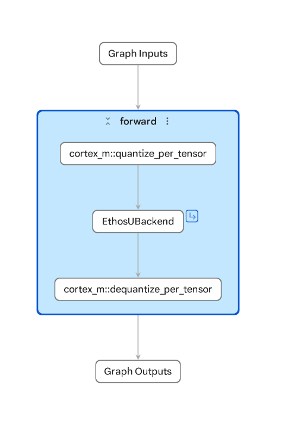
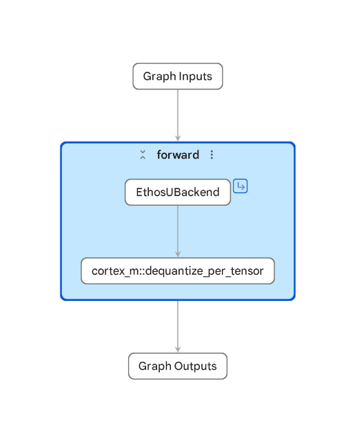

# Setting up the MLEK build environment

- Tested in Ubuntu Linux 24.04
- with Arm GNU Toolchain 13.3.Rel1

Clone the repository and update dependencies.
```
git clone https://github.com/alifsemi/alif_ml-embedded-evaluation-kit.git
cd alif_ml-embedded-evaluation-kit
git submodule update --init --recursive
```

Build and install framework and prepare tools and example models
```
python set_up_default_resources.py --ml-framework=executorch
```
This installs ExecuTorch and the ARM tools like the Vela compiler and prepares the example project models
The tools are installed to a python virtual environment under MLEK repo

You can install a separate instance of ExecuTorch, but it is important to use the same version of ExecuTorch when exporting the model and when compiling the runtime.
It is easy to use the correct ExecuTorch version and tools installed by the `set_up_default_resources.py` script by activating the environment from MLEK.
```
source resources_downloaded/env/bin/activate
```

Check the installation:
```
pip list | grep executorch
vela --version
```


# Exporting the model to .pte (lowering and quantization)

In order to run a PyTorch model in Alif target HW the model needs to go through the ExecuTorch export process including
lowering, quantization and finally serialization to .pte format. The process includes setting the model shape specification and using representative data for calibration.

Overall process is well described in [ExecuTorch model export documentation](https://docs.pytorch.org/executorch/1.0/using-executorch-export.html)

In addition to generic export documentation there is [Ethos-U specific backend documentation](https://docs.pytorch.org/executorch/1.0/backends-arm-ethos-u.html).

See also [Ethos-U tutorial](https://docs.pytorch.org/executorch/1.0/tutorial-arm-ethos-u.html).

Reading especially the Ethos-U tutorial [memory modes part](https://docs.pytorch.org/executorch/1.0/backends-arm-ethos-u.html#ethos-u-memory-modes) is highly recommended.

ExecuTorch ARM examples include a [porting guide](https://github.com/pytorch/executorch/blob/main/examples/arm/ethos-u-porting-guide.md) which has similar content as the above links, but a bit more from the code examples point of view.

## Requirements

**NOTE:** you can skip this installation step if you are working from the MLEK environment where `set_up_default_resources.py` script does the installation.

**NOTE:** Use the same version for model export and for target runtime.

**NOTE:** It is a good idea to use python virtual environment or equivalent container solution

Install ExecuTorch from source. Here we have chosen to use version 1.0.

```
git clone git@github.com:pytorch/executorch.git
cd executorch
git checkout release/1.0
git submodule sync && git submodule update --init --recursive
./install_executorch.sh
./examples/arm/setup.sh --i-agree-to-the-contained-eula
```

## Example script

In this example we export a pre trained model form torchvision.models. The important point here is how to configure the compilation for the target system using EthosUCompileSpec.
Before running the script activate the virtual environment you have created or use the one from MLEK repository.

**Note:** Alif specific Vela configuration can be found at https://github.com/alifsemi/alif_ml-embedded-evaluation-kit/blob/main/scripts/vela/ensemble_vela.ini

Choose `EthosUCompileSpec` system_config based on model size and performance based requirements and constraints.
In this example we expect the quantized model .pte fits to SoC internal NVM (MRAM) and the internal SRAM is enough
for the execution of the model graph (input and output tensors and any temporary runtime allocations done by the framework fit to SRAM)

```
source resources_downloaded/env/bin/activate
```

```
import torch

from executorch.exir import (
    EdgeCompileConfig,
    ExecutorchBackendConfig,
    to_edge_transform_and_lower,
)

from torchao.quantization.pt2e.quantize_pt2e import convert_pt2e, prepare_pt2e

from executorch.backends.arm.ethosu import EthosUPartitioner, EthosUCompileSpec
from executorch.backends.arm.quantizer import (
    EthosUQuantizer,
    get_symmetric_quantization_config,
)

# For Cortex M optimization
from executorch.backends.cortex_m.passes.quantized_op_fusion_pass import (
    QuantizedOpFusionPass,
)
from executorch.backends.cortex_m.passes.replace_quant_nodes_pass import (
    ReplaceQuantNodesPass,
)

# Your PyTorch model here
from torchvision.models import mobilenetv2

model = mobilenetv2.mobilenet_v2(
    weights=mobilenetv2.MobileNet_V2_Weights.DEFAULT
)

# Test model eval (sets the model to evaluation mode)
model.eval()

# Note: Use realistic calibration/representative input data in order to get good quantization results
#       Random data for demonstration only
inputs = (torch.randn(1, 3, 224, 224),)

outputs = model(*inputs)
print(f"Model output: {outputs}")

# Export PyTorch model (floating point)
exported_program = torch.export.export(model, inputs, strict=True)
graph_module = exported_program.module(check_guards=False)

# Configure compile spec for Ethos-U85 on Ensemble E8
compile_spec = EthosUCompileSpec(
        target = "ethos-u85-256",
        config_ini="scripts/vela/ensemble_vela.ini",
        system_config="Ethos_U85_SRAM_MRAM",
        memory_mode="Shared_Sram",
        extra_flags=["--output-format=raw --debug-force-regor"]
)

# Do post training quantization
quantizer = EthosUQuantizer(compile_spec)
operator_config = get_symmetric_quantization_config(is_per_channel=False)
quantizer.set_global(operator_config)

graph_module_q = prepare_pt2e(graph_module, quantizer)
graph_module_q(*inputs)
graph_module_q = convert_pt2e(graph_module_q)

exported_program_q = torch.export.export(graph_module_q, inputs, strict=True)

# Lower the exported model to Ethos-U backend using the defined compile spec
edge_prog = to_edge_transform_and_lower(
    exported_program_q,
    partitioner=[EthosUPartitioner(compile_spec)],
    compile_config=EdgeCompileConfig(
        _check_ir_validity=False,
    ),
)

# Use Cortex M optimized backend for quantization and dequantization steps
replace_quant_passes = [ReplaceQuantNodesPass()]
replace_quant_passes.append(QuantizedOpFusionPass())
edge_prog = edge_prog.transform(replace_quant_passes)

et_prog = edge_prog.to_executorch(config=ExecutorchBackendConfig(extract_delegate_segments=False))

with open("model.pte", "wb") as file:
    et_prog.write_to_file(file)

```

Example output:
```
...

Network summary for out
Accelerator configuration               Ethos_U85_256
System configuration              Ethos_U85_SRAM_MRAM
Memory mode                               Shared_Sram
Accelerator clock                                 400 MHz
Design peak SRAM bandwidth                      11.92 GB/s
Design peak Off-chip Flash bandwidth             0.72 GB/s

Total SRAM used                               1474.39 KiB
Total Off-chip Flash used                     2839.62 KiB

CPU operators = 0 (0.0%)
NPU operators = 65 (100.0%)

Average SRAM bandwidth                           2.36 GB/s
Input   SRAM bandwidth                          16.07 MB/batch
Weight  SRAM bandwidth                           9.27 MB/batch
Output  SRAM bandwidth                           7.42 MB/batch
Total   SRAM bandwidth                          33.88 MB/batch
Total   SRAM bandwidth            per input     33.88 MB/inference (batch size 1)

Average Off-chip Flash bandwidth                 0.19 GB/s
Input   Off-chip Flash bandwidth                 0.00 MB/batch
Weight  Off-chip Flash bandwidth                 2.77 MB/batch
Output  Off-chip Flash bandwidth                 0.00 MB/batch
Total   Off-chip Flash bandwidth                 2.77 MB/batch
Total   Off-chip Flash bandwidth  per input      2.77 MB/inference (batch size 1)

Neural network macs                         300987520 MACs/batch

INFO:quant_op_fusion_pass:QuantizedOpFusionPass.call() started
INFO:quant_op_fusion_pass:Total changes: 0

```

Note you can add parameters given to Vela using the compile specification extra_flags. For example --verbose-performance --verbose-cycle-estimate --verbose-weights can be useful.

## Visualize exported PTE

You can use the model-explorer to visualize the exported PTE file.

See [PTE Adapter for Model Explorer](https://github.com/arm/pte-adapter-model-explorer)

```
pip install pte-adapter-model-explorer
```

```
model-explorer --extensions=pte_adapter_model_explorer model.pte
```




## Optimizing the input and output tensor type

The default ExecuTorch export behaviour is to keep input and output tensors of the model graph as floats. In some cases you may want to skip the float conversions.
For example converting camera frame from typical 8-bit integer to float input tensor needs 4x memory and consumes CPU resources. Then the first step of the model graph would convert it back from normalized floats to int8 quantized.
Here is an example how to skip the float conversions in such a case. See [Ethos-U porting guide](https://github.com/pytorch/executorch/blob/main/examples/arm/ethos-u-porting-guide.md) for reference.

```
edge_prog = to_edge_transform_and_lower(...)
from executorch.exir.passes.quantize_io_pass import QuantizeInputs

# Apply the QuantizeInputs to input tensor 0
edge_prog.transform(passes=[QuantizeInputs(edge_prog, [0])])

# Convert edge program to executorch
et_prog = edge_prog.to_executorch(config=ExecutorchBackendConfig(extract_delegate_segments=False))
```

If desired, the output tensor conversion can be handled in similar manner.

Now the exported program should look like this.




# Building the ExecuTorch runtime in MLEK

For generic MLEK example use-case build instructions [see](../ML_Embedded_Evaluation_Kit.md)


Here is an example CMAKE configuration for using the `model.pte` exported earlier in this guide (`model.pte` in MLEK root).

**NOTE:** E8 has both Ethos-U55 and Ethos-U85 NPU, choose the one you delegated to in the export script EthosUCompileSpec.

```
    cmake -DTARGET_PLATFORM=alif \
    -DTARGET_SUBSYSTEM=RTSS-HP \
    -DTARGET_BOARD=DevKit-e8 \
    -DCMAKE_TOOLCHAIN_FILE=scripts/cmake/toolchains/bare-metal-gcc.cmake \
    -DCONSOLE_UART=4 \
    -DCMAKE_BUILD_TYPE=Release \
    -DMLEK_LOG_LEVEL=MLEK_LOG_LEVEL_DEBUG \
    -DUSE_CASE_BUILD=alif_img_class \
    -DETHOS_U_NPU_ID=U85 \
    -Dalif_img_class_MODEL_PATH=model.pte \
    -DML_FRAMEWORK=ExecuTorch ..
```

```
make -j8 mlek_alif_img_class
```

- Please see also the [Memory usage and linker files](../ML_Embedded_Evaluation_Kit.md#memoryusage)

If the on chip SRAM is not enough the DevKit-E8 and AppKit-E8 have external OSPI | HEXSPI RAM on board which can be used for model execution.
The external RAM can be enabled in build time using CMAKE variable `-DOSPI_RAM_SUPPORT=ON`.
- In Addition to setting the CMAKE variable some linker file changes are needed.
- To optimize performance when using external RAM the model needs to be exported using corresponding system configuration where Ethos-U has a scratch buffer in internal SRAM.

By default the example use-case puts the serialized model graph and weights to MRAM (NVM)

- For larger models you may want to enable `-DOSPI_FLASH_SUPPORT=ON`. Please check [Running a use-case with ML model data in external flash](../ML_Embedded_Evaluation_Kit.md#externalflash)


# See also

For generic Pre- and Post processing tips [see](custom_model_pre_post_processing.md)
