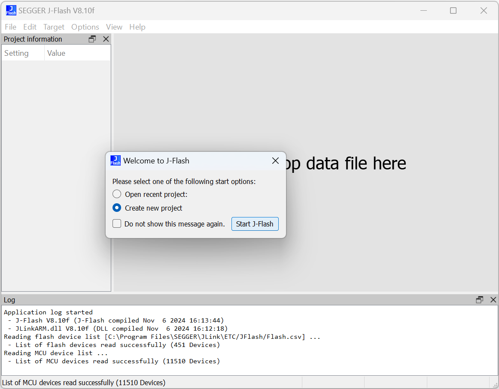
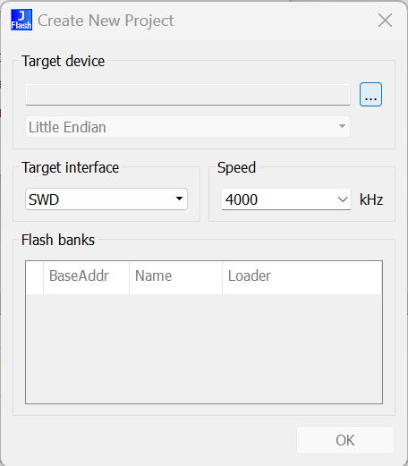
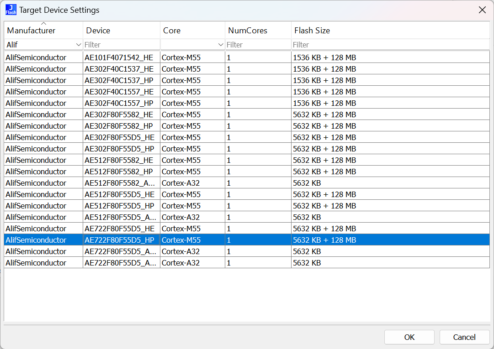
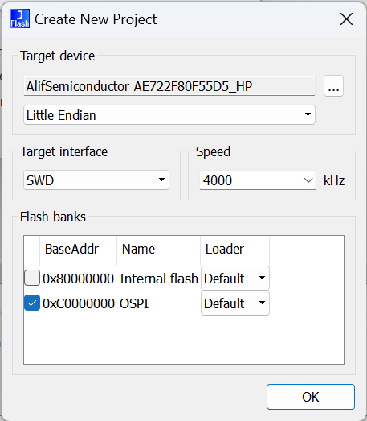
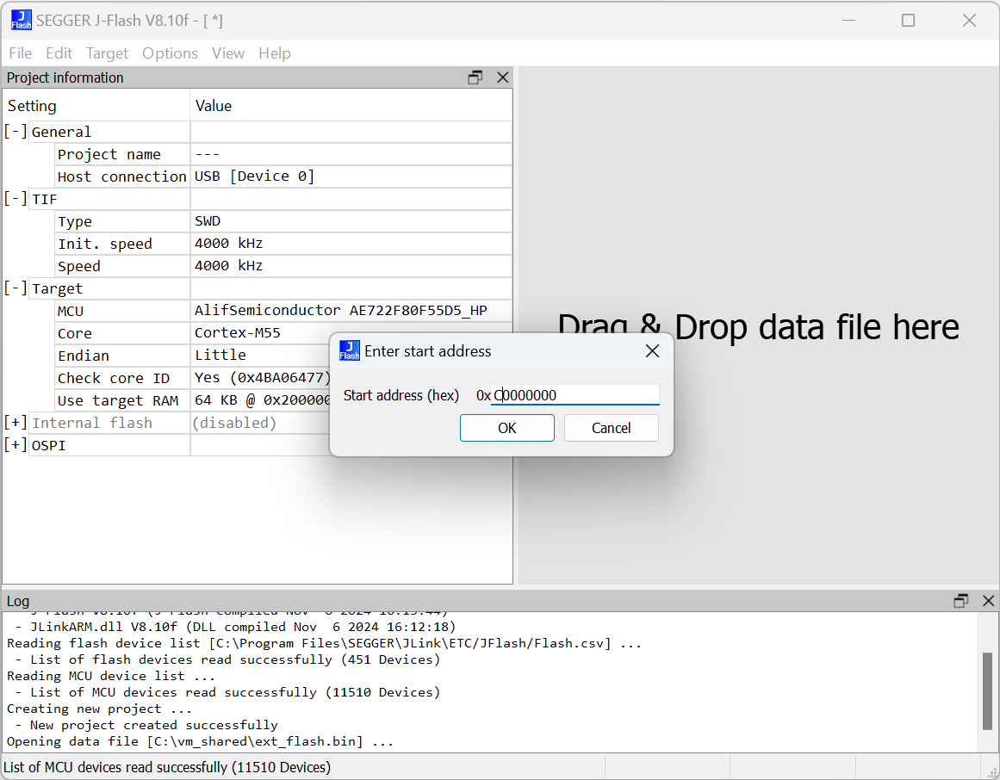
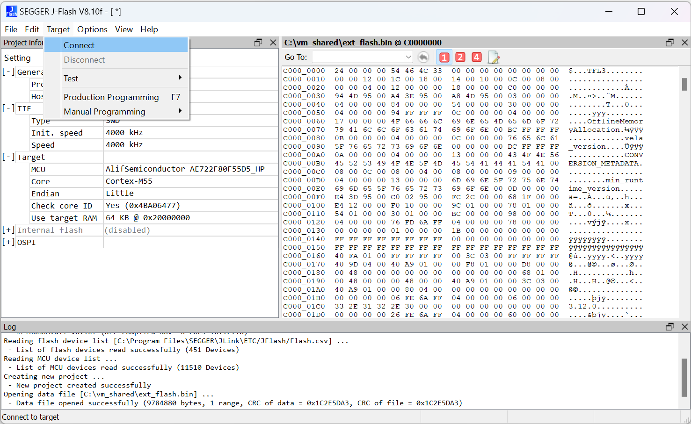
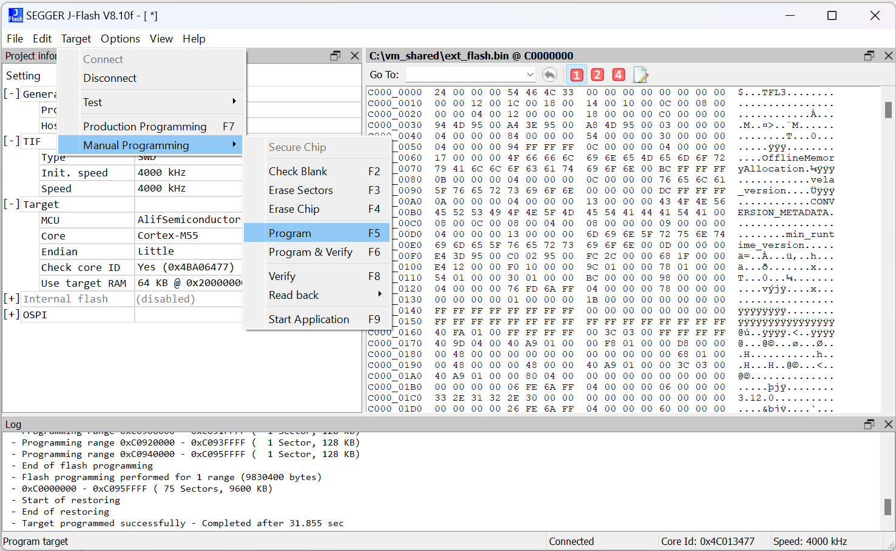
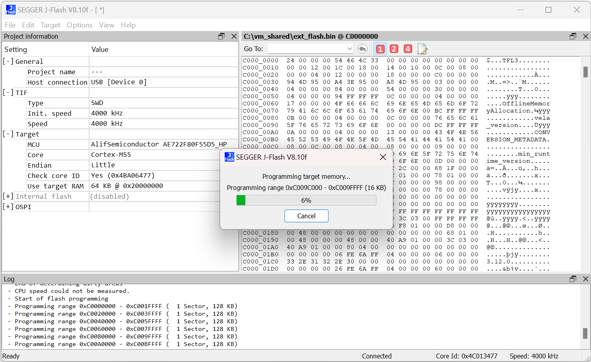

# Programming external OSPI flash on Alif development boards using J-Link
The OSPI flash on DevKit board is not directly connected to available hardware connectors so programming the flash device has to be done using one of the CPUs on the SoC.
In this example we use Segger's flash algorithm [SEGGER Flash Loader](https://wiki.segger.com/SEGGER_Flash_Loader).
Using the CMSIS FLM algorithm via [Device Support Kit](https://wiki.segger.com/J-Link_Device_Support_Kit) is not covered, but the overall process is similar.

## Flash algorithm
Flash algorithm is a small software which is automatically loaded by the debugger to target RAM. The flash programming software running on PC communicates with the flash algorithm running on the target CPU and the flash algorithm then erases, writes and verifies the data on actual flash device

## Requirements
- J-Link model higher than J-Link BASE [See J-Flash requirements](https://www.segger.com/products/debug-probes/j-link/tools/j-flash/about-j-flash)
- J-Link software including J-Flash tool [Download](https://www.segger.com/downloads/jlink/)

This guide has been verified with
- Segger J-Link Ultra+ debugger
- J-Link software V8.10f

Even though not covered, you should be able to program the flash with [J-Flash Lite](https://wiki.segger.com/J-Flash_Lite) using the BASE model probe. The process is similar.

## J-Flash project
J-Flash is a tool which comes with Segger’s J-Link software package. After installation it can be found from Windows start menu or using the search.

- After starting J-Flash, begin by creating a project.
  


- Click open the Target device menu.
  


- And choose the correct device with the external flash. Don't worry if the size here is shown as 128MB (Boards have 32MB or 64MB flash chips).
  


- Finally select the OSPI flash bank as we are not programming the MRAM now.
  


- Now the project settings are ready and you can drag and drop the `ext_flash.bin` to J-Flash window.
- Remember to set the starting address to start of external flash (0xC0000000).
  

- Connect the JTAG debugger HW if not yet done and click Connect from the Target menu.
  
- If you have trouble connecting, try pressing the reset button and/or powering the board off and on again
  - It is a good idea to install the CPU stubs using SE Toolkit especially when your application on MRAM wants to access the OSPI peripheral
  ```
  app-gen-toc.exe -f build\config\app-cpu-stubs.json
  app-write-mram.exe -p
  ```

- After successful connection, you can do programming step by step using the Target->Manual Programming menu.
- From the Target menu you'll find the Manual Programming->Program
  

- Or you can use the automated Target->Production Programming which does a full Erase, Program and Verify cycle.
  
