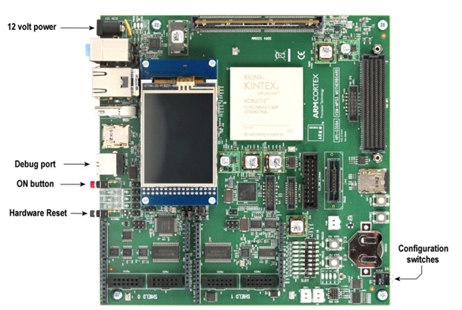

# Deployment

- [Fixed Virtual Platform](#fixed-virtual-platform)
  - [Setting up the MPS3 Arm Corstone-300 FVP](#setting-up-the-mps3-arm-corstone-300-fvp)
  - [Deploying on an FVP emulating MPS3](#deploying-on-an-fvp-emulating-mps3)
- [MPS3 board](#mps3-board)
  - [Deployment on MPS3 board](#deployment-on-mps3-board)

The sample application for Arm® Ethos™-U55 can be deployed on two
target platforms, both of which implement the Arm® Corstone™-300 design (see
<https://www.arm.com/products/iot/soc/corstone-300>):

- A physical Arm MPS3 FPGA prototyping board

- An MPS3 FVP

## Fixed Virtual Platform

The FVP is available publicly from [Arm Ecosystem FVP downloads
](https://developer.arm.com/tools-and-software/open-source-software/arm-platforms-software/arm-ecosystem-fvps).
Download the correct archive from the list under `Arm Corstone-300`. We need the one which:

- Emulates MPS3 board (not for MPS2 FPGA board)
- Contains support for Arm® Ethos™-U55

> **Note:** Currently, the FVP only has a Linux OS version. Also, there are no FVPs available for `SSE-200`
> which satisfy the above conditions.

For FVP, the elf or the axf file can be run using the Fast Model
executable as outlined under the [Starting Fast Model simulation](./setup.md/#starting-fast-model-simulation)
except for the binary being pointed at here
is the one just built using the steps in the previous section.

### Setting up the MPS3 Arm Corstone-300 FVP

For Ethos-U55 sample application, please download the MPS3 version of the
Arm® Corstone™-300 model that contains Ethos-U55 and Arm® Cortex®-M55. The model is
currently only supported on Linux based machines. To install the FVP:

- Unpack the archive

- Run the install script in the extracted package

    `./FVP_Corstone_SSE-300_Ethos-U55.sh`

- Follow the instructions to install the FVP to your desired location

### Deploying on an FVP emulating MPS3

This section assumes that the FVP has been installed (see [Setting up the MPS3 Arm Corstone-300 FVP](#Setting-up-the-MPS3-Arm-Corstone-300-FVP)) to the user's home directory `~/FVP_Corstone_SSE-300_Ethos-U55`.

The installation, typically, will have the executable under `~/FVP_Corstone_SSE-300_Ethos-U55/model/<OS>_<compiler-version>/`
directory. For the example below, we assume it to be `~/FVP_Corstone_SSE-300_Ethos-U55/models/Linux64_GCC-6.4`.

To run a use case on the FVP, from the [Build directory](../sections/building.md#Create-a-build-directory):

```commandline
~/FVP_Corstone_SSE-300_Ethos-U55/models/Linux64_GCC-6.4/FVP_Corstone_SSE-300_Ethos-U55 -a ./bin/ethos-u-<use_case>.axf
telnetterminal0: Listening for serial connection on port 5000
telnetterminal1: Listening for serial connection on port 5001
telnetterminal2: Listening for serial connection on port 5002
telnetterminal5: Listening for serial connection on port 5003

    Ethos-U rev 0 --- Oct 13 2020 11:27:45
    (C) COPYRIGHT 2019-2020 Arm Limited
    ALL RIGHTS RESERVED
```

This will also launch a telnet window with the sample application's standard output and error log entries containing
information about the pre-built application version, TensorFlow Lite Micro library version used, data type as well as
the input and output tensor sizes of the model compiled into the executable binary.

After the application has started it outputs a menu and waits for the user input from telnet terminal.

For example, the image classification use case can be started by:

```commandline
~/FVP_Corstone_SSE-300_Ethos-U55/models/Linux64_GCC-6.4/FVP_Corstone_SSE-300_Ethos-U55 -a ./bin/ethos-u-img_class.axf
```

The FVP supports many command line parameters:

- passed by using `-C <param>=<value>`. The most important ones are:
  - `ethosu.num_macs`: Sets the Ethos-U55 configuration for the model. Valid parameters are `32`, `64`, `256`,
    and the default one `128`. The number signifies the 8x8 MACs performed per cycle count available on the hardware.
  - `cpu0.CFGITCMSZ`: ITCM size for the Cortex-M CPU. Size of ITCM is pow(2, CFGITCMSZ - 1) KB
  - `cpu0.CFGDTCMSZ`: DTCM size for the Cortex-M CPU. Size of DTCM is pow(2, CFGDTCMSZ - 1) KB
  - `mps3_board.telnetterminal0.start_telnet` : Starts the telnet session if nothing connected.
  - `mps3_board.uart0.out_file`: Sets the output file to hold data written by the UART
    (use '-' to send all output to stdout, empty by default).
  - `mps3_board.uart0.shutdown_on_eot`: Sets to shutdown simulation when a EOT (ASCII 4) char is transmitted.
  - `mps3_board.visualisation.disable-visualisation`: Enables or disables visualisation (disabled by default).

  To start the model in `128` mode for Ethos-U55:

    ```commandline
    ~/FVP_Corstone_SSE-300_Ethos-U55/models/Linux64_GCC-6.4/FVP_Corstone_SSE-300_Ethos-U55 -a ./bin/ethos-u-img_class.axf -C ethosu.num_macs=128
    ```

- `-l`: shows the full list of supported parameters

    ```commandline
    ~/FVP_Corstone_SSE-300_Ethos-U55/models/Linux64_GCC-6.4/FVP_Corstone_SSE-300_Ethos-U55 -l
    ```

- `--stat`: prints some run statistics on simulation exit

    ```commandline
    ~/FVP_Corstone_SSE-300_Ethos-U55/models/Linux64_GCC-6.4/FVP_Corstone_SSE-300_Ethos-U55 --stat
    ```

- `--timelimit`: sets the number of wall clock seconds for the simulator to run, excluding startup and shutdown.

## MPS3 board

> **Note:**  Before proceeding, make sure you have the MPS3 board powered on,
and USB A to B connected between your machine and the MPS3.
The connector on the MPS3 is marked as "Debug USB".



1. MPS3 board top view.

Once the board has booted, the micro SD card will enumerate as a mass
storage device. On most systems this will be automatically mounted, but
you might need to mount it manually.

Also, there should be four serial-over-USB ports available for use via
this connection. On Linux based machines, these would typically be
*/dev/ttyUSB\<n\>* to */dev/ttyUSB\<n+3\>*.

The default configuration for all of them is 115200, 8/N/1 (15200 bauds,
8 bits, no parity and 1 stop bit) with no flow control.

> **Note:** For Windows machines, additional FTDI drivers might need to be installed
for these serial ports to be available.
For more information on getting started with an MPS3 board, please refer to
<https://developer.arm.com/-/media/Arm%20Developer%20Community/PDF/MPS3GettingStarted.pdf>

### Deployment on MPS3 board

> **NOTE**: These instructions are valid only if the evaluation is being
 done using the MPS3 FPGA platform using either `SSE-200` or `SSE-300`.

To run the application on MPS3 platform, firstly it's necessary to make sure
that the platform has been set up using the correct configuration.
For details, on platform set up, please see the relevant documentation. For `Arm Corstone-300`, this is available
[here](https://developer.arm.com/-/media/Arm%20Developer%20Community/PDF/DAI0547B_SSE300_PLUS_U55_FPGA_for_mps3.pdf?revision=d088d931-03c7-40e4-9045-31ed8c54a26f&la=en&hash=F0C7837C8ACEBC3A0CF02D871B3A6FF93E09C6B8).

For MPS3 board, instead of loading the axf file directly, the executable blobs
generated under the *sectors/<use_case>* subdirectory need to be
copied over to the MP3 board's micro SD card. Also, every use case build
generates a corresponding images.txt file which is used by the MPS3 to
understand which memory regions the blobs are to be loaded into.

Once the USB A <--> B cable between the MPS3 and the development machine
is connected and the MPS3 board powered on, the board should enumerate
as a mass storage device over this USB connection.
There might be two devices also, depending on the version of the board
you are using. The device named `V2M-MPS3` or `V2MMPS3` is the `SD card`.

If the axf/elf file is within 1MiB, it can be flashed into the FPGA
memory directly without having to break it down into separate load
region specific blobs. However, with neural network models exceeding
this size, it becomes necessary to follow this approach.

1. For example, the image classification use case will produce:

    ```tree
    ./bin/sectors/
        └── img_class
            ├── dram.bin
            └── itcm.bin
    ```

    For example, if the micro SD card is mounted at
    /media/user/V2M-MPS3/:

    ```commandline
    cp -av ./bin/sectors/img_class/* /media/user/V2M-MPS3/SOFTWARE/
    ```

2. The generated `\<use-case\>_images.txt` file needs to be copied
over to the MPS3. The exact location for the destination will depend
on the MPS3 board's version and the application note for the bit
file in use.
For example, for MPS3 board hardware revision C, using an
application note directory named "ETHOSU", to replace the images.txt
file:

    ```commandline
    cp ./bin/images-img_class.txt /media/user/V2M-MPS3/MB/HBI0309C/ETHOSU/images.txt
    ```

3. Open the first serial port available from MPS3, for example,
"/dev/ttyUSB0". This can be typically done using minicom, screen or
Putty application. Make sure the flow control setting is switched
off.

    ```commandline
    minicom --D /dev/ttyUSB0
    ```

    ```log
    Welcome to minicom 2.7.1
    OPTIONS: I18n
    Compiled on Aug 13 2017, 15:25:34.
    Port /dev/ttyUSB0, 16:05:34
    Press CTRL-A Z for help on special keys
    Cmd>
    ```

4. In another terminal, open the second serial port, for example,
    "/dev/ttyUSB1":

    ```commandline
    minicom --D /dev/ttyUSB1
    ```

5. On the first serial port, issue a "reboot" command and press the
    return key

    ```commandline
    $ Cmd> reboot
    ```

    ```log
    Rebooting...Disabling debug USB..Board rebooting...

    ARM V2M-MPS3 Firmware v1.3.2
    Build Date: Apr 20 2018

    Powering up system...
    Switching on main power...
    Configuring motherboard (rev C, var A)...
    ```

    This will go on to reboot the board and prime the application to run by
    flashing the binaries into their respective FPGA memory locations. For example:

    ```log
    Reading images file \MB\HBI0309C\ETHOSU\images.txt
    Writing File \SOFTWARE\itcm.bin to Address 0x00000000

    ............

    File \SOFTWARE\itcm.bin written to memory address 0x00000000
    Image loaded from \SOFTWARE\itcm.bin
    Writing File \SOFTWARE\dram.bin to Address 0x08000000

    ..........................................................................


    File \SOFTWARE\dram.bin written to memory address 0x08000000
    Image loaded from \SOFTWARE\dram.bin
    ```

6. When the reboot from previous step is completed, issue a reset
        command on the command prompt.

    ``` commandline
    $ Cmd> reset
    ```

    This will trigger the application to start, and the output should be visible on the second serial connection.

7. On the second serial port, output similar to section 2.2 should be visible:

    ```log
    [INFO] Setting up system tick IRQ (for NPU)
    [INFO] V2M-MPS3 revision C
    [INFO] Application Note AN540, Revision B
    [INFO] FPGA build 1
    [INFO] Core clock has been set to: 32000000 Hz
    [INFO] CPU ID: 0x410fd220
    [INFO] CPU: Cortex-M55 r0p0
    ...
    ```


Next section of the main documentation, [Running code samples applications](../documentation.md#Running-code-samples-applications).
